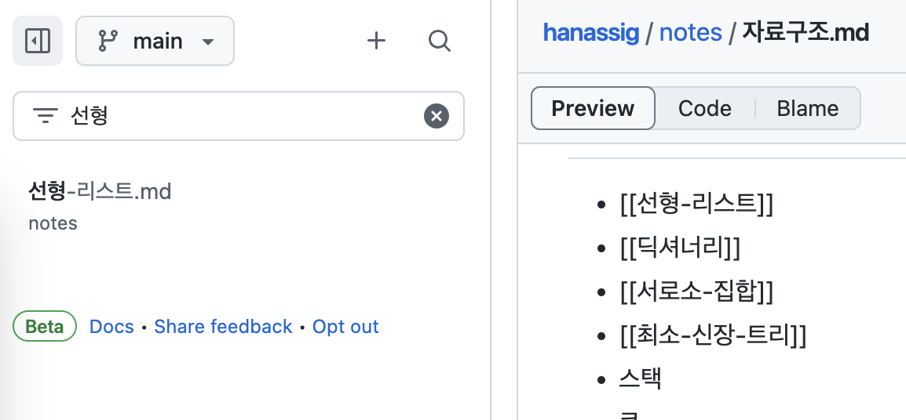

# hanassig

배운 것들을 하나씩 정리합니다.

## GitHub에서 보기

GitHub Code View가 좋아져서[^1] 별도로 웹 페이지로 발행하지 않아도 웹에서
보기 괜찮아졌습니다.

[^1]: https://docs.github.com/en/repositories/working-with-files/managing-files/navigating-files-with-the-new-code-view

정말 혹시라도 이 글들을 GitHub에서 보시고자 한다면 아래를 참고하시기 바랍니다:

- 모든 글은 `notes` 디렉토리 안에 있습니다.
- 큰 갈래는 [index.md](notes/index.md)에서 나누고 있으니 해당 파일을 참고하시기 바랍니다.
- GFM과 호환되지 않는 위키링크 문법을 쓰고 있어 링크 연결이 되지 않습니다.
  - `[[파일-이름]]`은 `notes` 디렉토리에 있는 파일입니다. 코드뷰에서 괄호 안의
    내용을 검색하시면 됩니다.
  - `[[#헤더]]`는 같은 글의 헤더를 가리키는 링크입니다. `ctrl-f`로 찾으시면 됩니다.
  - `[[파일-이름#헤더]]`는 다른 글의 특정 헤더를 가리키는 링크입니다.
