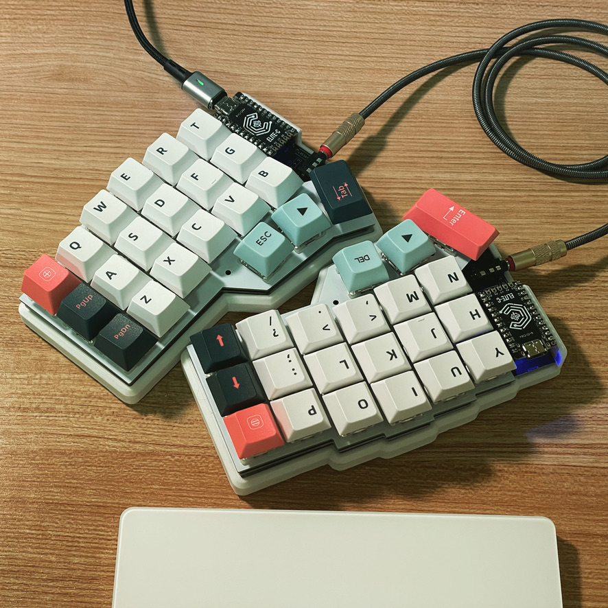

# Corne Keyboard

[footsan/crkbd](https://github.com/foostan/crkbd)

3x6 사이즈 + 3 엄지 세로 스테거 스플릿 키보드

- 키캡: 까먹었다
- 스위치: 게이트론 저소음 갈축
- MCU: ELITE-C, nice!nano
- 케이스: 3D printed
- 펌웨어: QMK, ZMK
- 보드: crkbd cherry v2, crkbd choco v3
- 배열: [[miryoku]] flip inverted T 변형
