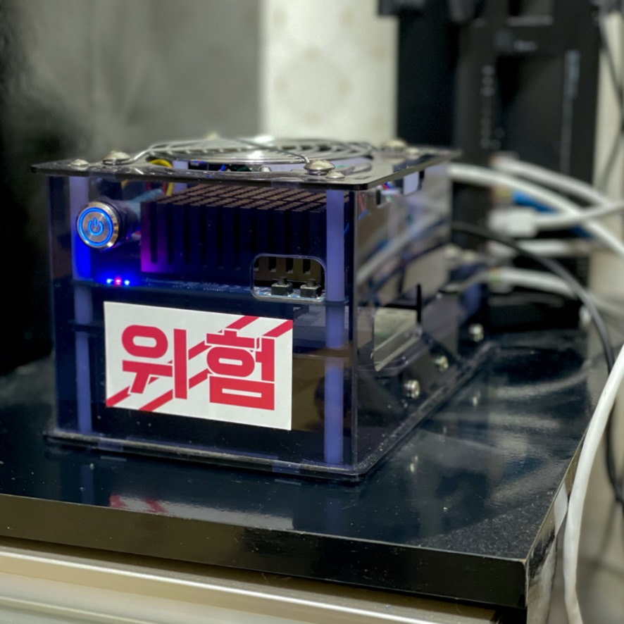

# UiBox

작고 조용한 SFF 서버 제작

## 구성

- UiBox: 서버
- [[UiRouter]]: 라우터

## 목표

- [ ] 비밀번호 관리 (vaultwarden)
- [ ] NAS
  - [x] samba
  - [ ] Nextcloud
- [ ] HomeAssistant
- [ ] 개발 서버
  - [ ] CI 서버
  - [ ] 원격으로 접속하여 쓸 수 있는 개발환경
- [ ] 웹 서버
- [ ] 윈도우 (게임 및 금융용)

### 비밀번호 관리

[bitwarden](https://bitwarden.com/)

오픈소스 비밀번호 관리 도구. 개인 사용자용으로 기본 기능은 무료이고, 유료로 추가 기능을 사용하거나 상업용으로 사용할 수 있다. 서버를 직접 호스팅하여 쓸 수도 있다. 서버에 설치하여 내 비밀번호를 내 서버에 저장해보자.

- [danci-garcia/vaultwarden](https://github.com/dani-garcia/vaultwarden)

### NAS 서버

대학 공부 자료, PDF, 전자책 뿐 아니라 친구, 가족과 찍은 사진도 저장한다.

TrueNAS나 OMV 같은 나스용 OS가 필요한지는... 고민해보자.

- nextcloud

### IoT 관리

[Home Assistant](https://www.home-assistant.io/installation/)

IoT 관리를 위한 경량 서버를 설치하여 집의 스마트 전구를 관리하자.

### 개발 서버

git, CI를 물려두고 푸쉬 훅을 돌리거나, x86 리눅스가 필요할 때 요긴하게 사용하자.

예로, 키보드를 만들때 QMK 개발환경을 M1 macOS에 구축하는게 번거로운데, 서버에서 작업하고 펌웨어를 내려받으면 된다.

### 웹 서버, 메일 서버

할 필요는 없지만 할 수 있는데 안 할 이유도 없다!

### 윈도우

가끔 금융 등 환경에서 필요한 경우가 있는데, VM으로 해결 가능한지 도전

GPU passthrough하여 간단한 스팀 게임 집에서 돌리기.

## 구성

### 하드웨어

- CPU: Intel Celeron J4105 (4) @ 2.5GHz
- GPU: Intel GeminiLake [UHD Graphics 600]
- RAM: 8GB
- MBD: ODROID-H2
- Storage:
	- OS Storage:  SAMSUNG PM981 M.2 NVMe SSD 256GB
	- Data Storage: HDD

### 소프트웨어 레이어

- Proxmox VE
  - Windoes VM
  - HomeAssistant VM
  - NAS VM: Nextcloud, vaultwarden
  - DevServer CT
  - WebServer CT

## 참고

- [Proxmox VE Wiki](https://pve.proxmox.com/wiki/Main_Page)
- [The Perfect Home Server Build! 18TB, 10Gbit LAN, Quiet & Compact](https://www.youtube.com/watch?v=qACTvCW_yDc)
- [awesome-selfhosted](https://github.com/awesome-selfhosted/awesome-selfhosted)
- [홈 서버 만들기 -- Varins](https://varins.com/library/server/)
