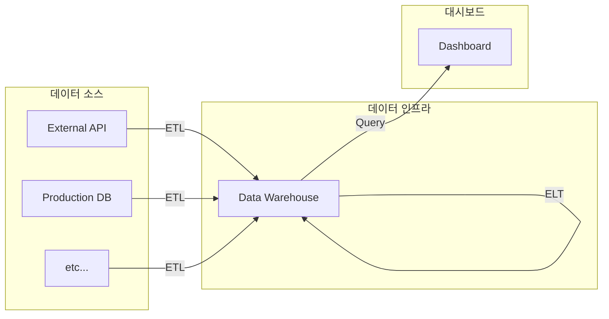

> Airflow is a platform created by the community to programmatically author,
> schedule and monitor workflows.

데이터 파이프라인을 구축하기 위한 워크플로우 관리 시스템.

아래 다이어그램은 데이터 파이프라인 예시이다. ETL, ELT와 같이 어떤 소스에서
데이터를 추출하고 가공하여 다시 데이터를 적재하는 일이 빈번하다. Airflow는
이러한 작업을 관리해주는 도구이다.

ETL

:   Extract, Transform, and Load의 약어. 외부 소스에서 데이터를 추출, 변형하여
    데이터 웨어하우스로 가져오는 작업.

ELT

:   Extract, Load, and Transform의 약어. 데이터 웨어하우스의 데이터를 추출하여
    조금 더 의미있는, 새로운 데이터로 만들어내는 작업.

## 특징

- DAG(directed acyclic graph)를 이용해 데이터 파이프라인을 표현.
- 클라우드 서비스들이 많다. GCP의 Cloud Composer, AWS의 MWAA, Azure의 DFMA 등.

## 구성

- 웹 서버: 웹UI 제공.
- 스케줄러: 워커들에게 작업을 배정해준다.
- 워커: 작업 실행자.
- 메타데이터 데이터베이스:
- 큐: 수평 확장(scale out)하는 경우 워커에게 작업을 분배해주기 위함.
