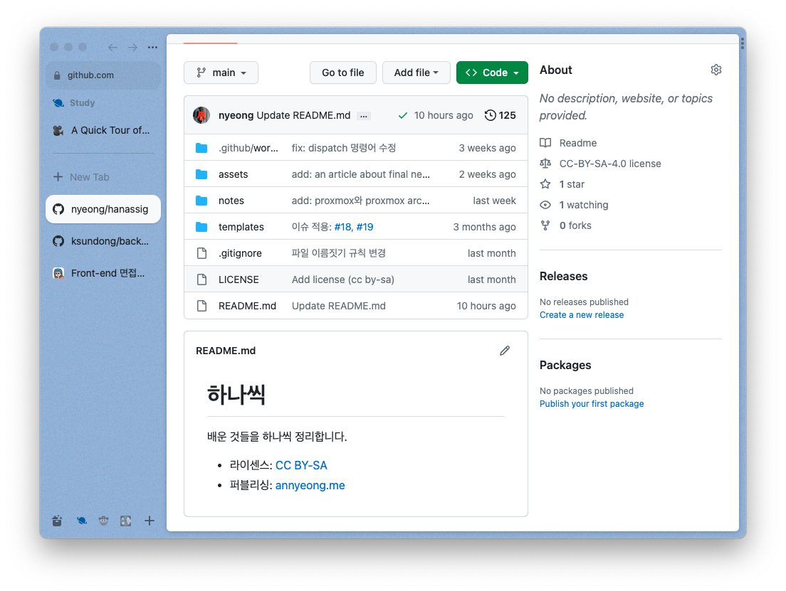
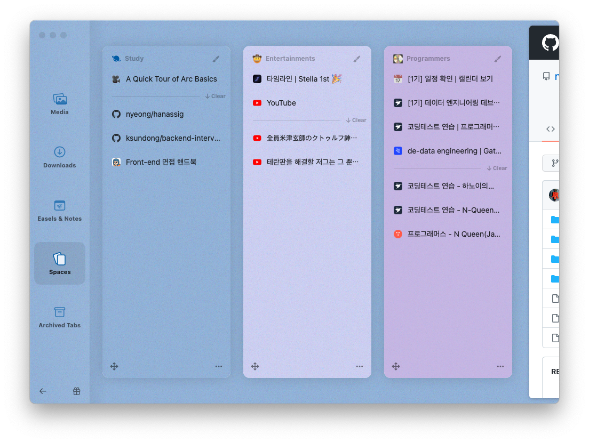

[The Browser Company](https://thebrowser.company/)라는 회사에서 만드는
브라우저. 23년 05월 17일 기준으로 waitlist를 통해서 베타에 참여할 수 있다.

## 장점

4. 사이드바 중심의 간단한 UI로 익히기 쉽다.
1. 목적에 따라 탭을 묶어 스페이스라는 단위로 관리할 수 있다.
2. 실행중인 동영상이 있을 때 화면을 벗어나면 자동으로 화면 속 화면이 실행된다.
3. 브라우저에서 그리기, 필기를 만들고 바로 공유할 수 있다.
5. 기본 단축키 설정이 합리적이다.

### 사이드바 중심의 UI

보통의 웹브라우저가 브라우저 상단에 가로로 긴 탭을 늘여놓는 것에 반해,
아크 브라우저는 좌측에 사이드바의 형태로 탭이 놓여있다.
브라우저로서는 낯설지만 익숙한 형태라 쉽게 익히고 적응할 수 있다.

이 사이드바에는 여러 스페이스를 만들 수 있는데, 이를 이용해서 열려있는
웹 페이지를 용도에 맞게 분리할 수 있다.

스페이스에 대한 제스처나 단축키도 직관적이다. 스페이스 위에 마우스 커서를 두고
두 손가락으로 좌우로 쓸어넘기면 스페이스를 오갈 수 있다. 탭을 핀 하거나
즐겨찾기로 등록하고 싶다면 스페이스의 상단으로 끌어 놓으면 된다. 
혹은 macOS를 기준으로 \<command + shift\>를 누른 채로 방향키를 누르면 스페이스를
오가거나 탭을 오갈 수 있다.
