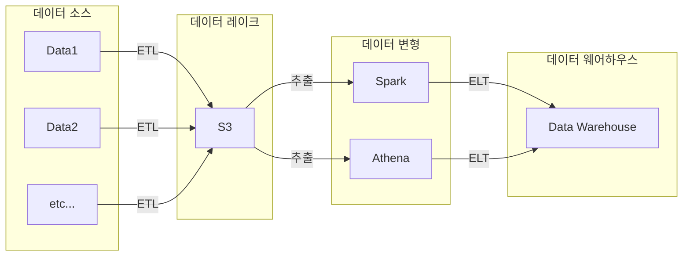

## 데이터 레이크 vs. 데이터 웨어하우스

데이터 레이크가 더 큰 개념이다.

- 데이터 레이크(data lake)
    - 구조화된 데이터 뿐 아니라 비구조화 데이터도 다룬다.
    - 모든 데이터를 원래 형태로 보존하는 스토리에 가깝다.
- 데이터 웨어하우스(data warehouse)
    - 보존 기한이 있는 구조화 데이터를 다룬다.
    - BI 대시보드 도구들의 백엔드로서 기능한다.

