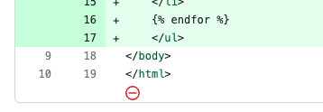

## 왜 개행해야 하는가

POSIX 표준으로 개행하도록 명시되어 있다.

3.206절에서 '줄'을 정의하는데, 반드시 개행문자로 끝나도록 정의되어 있다.

> [3.206 Line](https://pubs.opengroup.org/onlinepubs/9699919799/basedefs/V1_chap03.html#tag_03_206)
>
> A sequence of zero or more non- \<newline\> characters plus a terminating \<newline\> character.

3.392절에서는 텍스트 파일을 정의하는데, 여러 '줄'로 이루어져있음을 명시하고 있다.

> [3.392 Text File](https://pubs.opengroup.org/onlinepubs/9699919799/basedefs/V1_chap03.html#tag_03_392)
>
> A file that contains characters organized into one or more lines. (후략)

OS 기반에 깔린 정의가 이러하기 때문에, 여러 프로그램들도 파일의 끝에 개행이
있을 것이라 가정하는 경우가 많다. 따라서 파일 끝에 개행 문자가 없으면 의도치
못한 동작을 겪을 수 있다.

예를 들어 `cat`으로 여러 파일을 여는 경우, 출력 후 개행이 안되어 알아보기
힘들거나, `wc --lines`로 파일의 줄을 세는 경우 의도한 결과가 다를 수 있다.

또한 개행 역시 문자로, 파일 변경의 영향을 받기 때문에 버전 관리에 영향을 미친다.
만약 아래처럼 개행문자로 끝내지 않았다면...

```diff
  def add(a, b), do: a + b⛔️
```

다음번 수정시 줄을 추가하기 위하여 개행을 할텐데, 이때 `add` 함수가 있는 줄에
개행 문자가 기록되기 때문에 역시 변경된 것으로 간주된다.

```diff
+ def add(a, b), do: a + b
+ def sub(a, b), do: a - b
```

정상적으로 개행문자와 함께 파일이 끝났다면 아래처럼 새로 추가된 줄만 변경사항으로
추적되어야 한다. [[elixir#후행-쉼표를-허용하지-아니함]] 참고

```diff
  def add(a, b), do: a + b
+ def sub(a, b), do: a - b
```

## helix

helix 에디터는 에디터가 내용에 적극적으로 관여하지 않고 대신 LSP나 포매터에
그 일을 위임한다. 따라서 언어별로 적절한 linter, formatter 등을 구성해서
해결해야한다.

```bash
# 언어별 설정 확인하기
$ hx --health python

# 필요하면 포매터나 LSP를 지정해준다.
$ hx ~/.config/helix/languages.toml
```

## VS Code

- `files.insertFinalNewline` 옵션을 켜주면 저장할 때 파일 끝에서 개행해준다.
- `files.trimFinalNewlines` 옵션은 파일 끝에 불필요한 개행이 여럿 있을 때 하나로
줄여준다.

```json
{
    "files.insertFinalNewline": true,
    "files.trimFinalNewlines": true
}
```

## 참고

- [Why should text files end with a newline?](https://gist.github.com/OleksiyRudenko/d51388345ea55767b7672307fe35adf3)
- EOL은 end of line의 약자로, 줄 끝의 개행 문자를 의미한다.
- [Why Should Text Files End With a Newline in Linux?](https://www.baeldung.com/linux/files-end-with-newlines)
