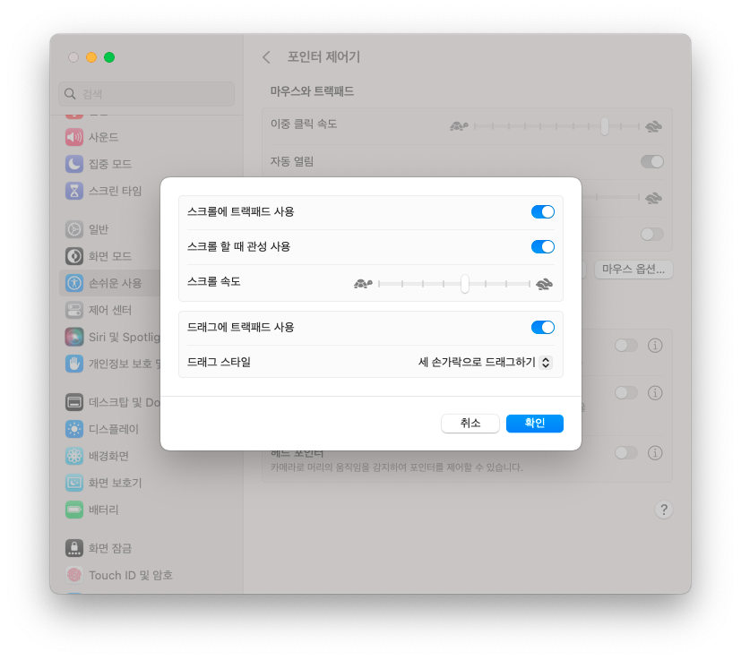
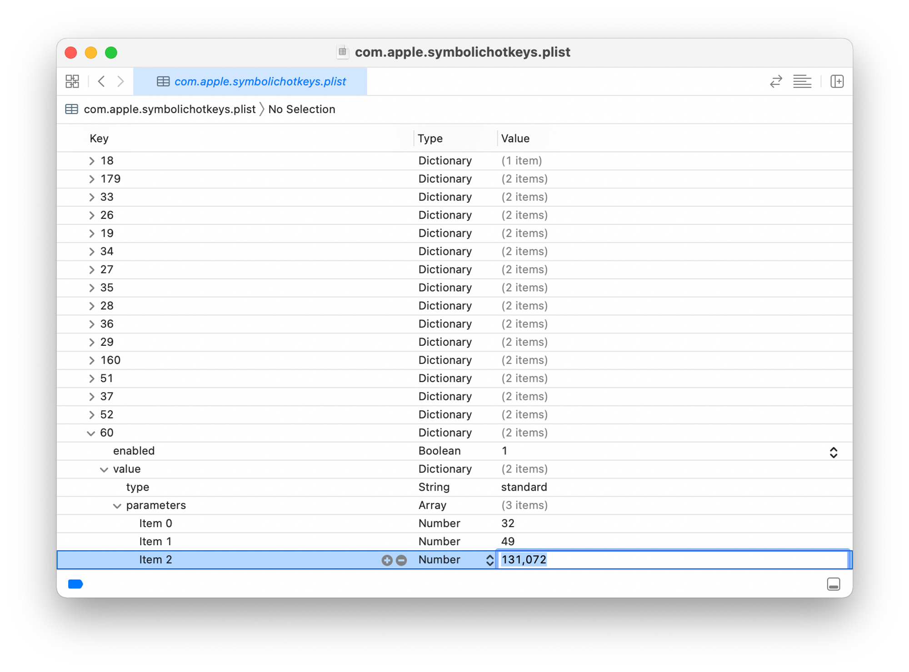

## 자잘한 설정

### 런치패드

기본앱 폴더 하나 만들어서 모조리 넣어버리자.

### 독 조절하기

- 독에 있는 모든 것을 없애기
  아이콘을 밖으로 드래그하면 없앨 수 있다
- 시스템 설정 → 데스크탑 및 Dock에서
  - Dock에서 최근 사용한 응용 프로그램 보기 끄기

### 미션 컨트롤

시스템 설정 → 데스크탑 및 Dock에서

- Spaces를 최근 사용 내역에 따라 자동으로 재정렬 끄기

### 시간

시스템 설정 → 일반 → 날짜 및 시간에서 24시간제 켜기

### 키보드

시스템 설정 → 키보드에서

- 키 반복 속도를 적당히 빠르게 설정
- 반복 지연 시간을 적당히 짧게 설정
- 키보드 탐색 켜기
- 텍스트 입력 → 편집…에서
  - Caps Lock키로 ABC 입력 소스 전환 끄기
  - 맞춤법 자동 수정 끄기
  - 자동으로 단어를 대문자로 시작 끄기
  - 스페이스를 두 번 눌러 마침표 추가 끄기
  - 스마트 인용 부호 및 대시 사용 끄기
  - 큰따옴표를 가장 마지막 것으로 변경
  - 작은따옴표를 가장 마지막 것으로 변경
- 키보드 단축키…에서
  - 보조 키에서 Caps Lock을 Escape로

### 트랙패드

시스템 설정 → 트랙패드에서

- 클릭을 가볍게로 바꾸기
- 탭하여 클릭하기를 끄기

시스템 설정 → 데스크탑 및 Dock에서 아래로 쭉 내려서 Mission Control에서 핫 코너…를 눌러서

- 오른쪽 아래에 빠른 메모를 `-`로 바꾸기

### 보안 관련

시스템 설정 → 화면 잠금에서

- 화면 보호기 시작 후 또는 디스플레이가 꺼진 후 암호 요구를 즉시로 바꾸기

시스템 설정 → 네트워크 → 방화벽에서 방화벽 켜기

### 호스트 이름 바꾸기

시스템 설정 → 일반 → 공유에서

가장 밑의 호스트 이름 → 편집… 눌러서 적당한 이름으로 변경

### 파인더 설정

Finder에서 커맨드+, 눌러서 설정 열어서

- 새로운 Finder 윈도우에서 보기를 홈폴더로 변경 (계정명과 동일한 폴더)

Finder 설정 고급에서

- 모든 파일 확장자 보기 켜기
- iCloud Drive에서 제거하기 전에 경고 표시 끄기
- 폴더 우선 정렬에서 윈도우에서와 데스크탑에서 모두 켜기

## 꿀팁

### ₩ 대신 백틱 입력하기

`~/Library/KeyBindings/DefaultkeyBinding.dict` 만들고 아래의 내용을 추가한다:

```python
{
  "₩" = ("insertText:", "`");
}
```

### 세 손가락으로 드래그하기

트랙패드로 드래그하려면 기본적으로 클릭을 해야 하는데 손에 힘들어가서 불편하다. 세 손가락으로 드래그하기를 켜면 그냥 손가락 세 개 올려놓고 슥 하면 드래그 된다.

1.  시스템 설정 → 손쉬운 사용 → 포인트 제어기 → 트랙패드 옵션…
    1.  드래그에 트랙패드 사용 켜기
    1.  드래그 스타일에 세 손가락으로 드래그하기



### shift - space로 한영 전환하기

언제부턴가 한/영 전환에 shift-space가 설정 안 되게 바뀌었다. 아래의 방법으로 강제로 가능하다.

1.  시스템 설의 키보드 > 단축키 > 이전 입력 소스를 더클클릭하고 아무 키나 입력한다. 수정하지 않으면 plist 에 수정할 값이 보이지 않기 때문이다.
2.  [PlistEdit](https://www.fatcatsoftware.com/plisteditpro/PlistEditPro.zip) 를 다운로드해서 설치 한다. Xcode 가 설치되어 있으면 Xcode 로 열 수 있다.
3.  파인더에서 사용자 폴더 아래의 라이브러리 폴더를 연다. 라이브러리 폴더는 숨김 처리되어 있다. 파인더 메뉴바의 ‘이동 메뉴’를 Option 키를 누른 상태에서 클릭하면 ‘라이브러리’ 폴더가 표시된다.
4.  라이브러리 풀더 아래 Preferences 안에서 다음 plist 파일을 PlistEdit Pro 로 연다./Users/사용자/Library/Preferences/com.apple.symbolichotkeys.plist
5.  Property List 에서 60을 찾는다. 맨 아래에 있을 것이다.
6.  `60/value/parameters/2`를 `131072`로 바꿔준다. 
7.  이후 재부팅하면 적용된다.

### 파인더 타이틀바 아이콘 딜레이 조절

<video controls>
  <source src="../assets/title-view-rollover.webm" type="video/webm" />
</video>

macOS Big Sur부터 타이틀바의 아이콘은 기본적으로 숨겨져 있고, 마우스를 올려야 나온다.

타이틀바에 아이콘을 계속 표시하려면 아래의 명령어를 Terminal에 입력한다:

```bash
defaults write com.apple.Preview NSWindowSupportsAutomaticInlineTitle -bool false && killall Finder
```

계속 표시하지는 않되, 마우스를 올리면 딜레이 없이 바로 나오게 하고자 하면 아래의 명령어를 입력한다:

```bash
defaults write NSGlobalDomain "NSToolbarTitleViewRolloverDelay" -float "0" && killall Finder
```

## 유용한 앱

### Karabiner-Elements

```bash
brew install karabiner-elements
```

[설정 파일](https://github.com/nyeong/.dotfiles/blob/2f7e43f314941bbd3c323ad9a21805cd3fe00f35/karabiner/assets/complex_modifications/nyeong.json)

내려받은 후 `~/.config/karabiner/assets/complex_modifications` 디렉토리 밑으로 파일을 넣어줍니다.

위의 설정은 아래의 동작을 합니다.

- 캡슬락을 짧게 누르면 ESC키로 동작합니다
- 캡슬락을 누른 채로 H, J, K, L을 누르면 방향키로 동작합니다.
- 캡슬락을 누른 채로 U, I, O, P를 누르면 Page Up, Home 등으로 동작합니다.
- 캡슬락을 누른 채로 스페이스 바를 누르면 백스페이스로 동작합니다.
- 캡슬락을 누른 채로 백스페이스를 누르면 delete로 동작합니다.

캡슬락을 이용하는 설정이므로
`시스템 환경설정` → `키보드` → `보조키...`에 들어가 Caps Lock키를 작업 없음으로 설정해줍니다.

### Hammerspoon

```bash
brew install hammerspoon
```

기본 설정 파일 위치가 `~/.hammerspoon`인데, `XDG_CONFIG` 디렉토리를 쓰고 싶다면 아래의 명령어로 `~/.config/hammerspoon`으로 바꾸면 된다.

```bash
defaults write org.hammerspoon.Hammerspoon MJConfigFile "~/.config/hammerspoon/init.lua"
```

바꾸고 아래의 설정파일을 심볼릭 링크

[.dotfiles/hammerspoon](https://github.com/nyeong/.dotfiles/tree/main/hammerspoon)
