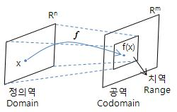

요약: 셋 다 합성을 쉽게 하기 위해서이다.

```haskell
class Monad m where
  (>>=)  :: m a -> (a -> m b) -> m b
  return :: a -> m a

class Functor f where
  fmap :: (a -> b) -> f a -> f b
  (<$) :: a -> f b -> f a

class (Functor f) => Applicative f where
  pure  :: a -> f a
  (<*>) :: f (a -> b) -> f a -> f b
```


## 문제제기

이진트리를 생각해보자. 어떤 노드는 그 밑에 왼쪽노드와 오른쪽노드가
있을 수도 있고, 없을 수도 있다. 

```elixir
defmodule Node do
  @type t :: %{left: Node.t | nil, right: Node.t | nil}
  defstruct [:left, :right]

  @spec left(Node.t) :: Node.t | nil
  def left(node), do: node.left

  @spec right(Node.t) :: Node.t | nil
  def right(node), do: node.right
end
```

여기서는 엘릭서로 표현하였으나, 대부분의 언어는 크게 다르지 않다.
파이썬이면 아래와 같을 것이다.

```python
class Node():
  left: Optional[Node]
  right: Optional[Node]

  def __init__(self, left=None, right=None):
    self.left = left
    self.right = right
```

어떤 노드 `node`의 왼쪽 자식이 노드라면 그 노드도 자식이 있을 수 있다.
`node`의 왼쪽 자식의 오른쪽 자식을 구하려면 함수를 중첩하여 `right(left(node))`
꼴로 호출을 하거나, 파이프 연산자(`|>`)를 이용하여 `node |> left() |> right()`
꼴로 구할 것이다.

그런데 `node`에게 왼쪽 자식이 없다면 어떨까?

```iex
iex> %Node{} |> left() |> right()
** (KeyError) key :right not found in: nil.
```

`%Node{} |> left()`가 `nil`이므로 `nil |> right()`를 하게 되는데, `nil`에서
`:right`를 찾을 수 없으므로 에러가 발생한다.

따라서 "어떤 노드의 왼쪽 자식의 오른쪽 자식"을 얻으려면 적절하게 에러를 예상하고
처리해주어야한다.

```elixir
# 먼저 확인하고 실행하거나
# LBLY: Look Before You Leap
case node |> left() do
  nil -> nil
  node -> node |> right()
end

# 일단 접근하고 예외로 처리하거나
# EAFP: Easier to Ask for Forgiveness
try do
  node |> left() |> right()
rescue
  e in KeyError -> nil
end
```

왜 이런 에러처리가 필요할까? `left()`의 반환 타입과 `right()`의 인자 타입이
다르기 때문이다. 용어로 바꾸어 표현하면 `left`의 공역(*codomain*)과
`right`의 정의역(*domain*)이 서로 맞지 않기 때문이다. 함수가 입력으로
받는 값들의 집합을 정의역(*domain*), 결과로 내뱉는 값들이 속한 집합을
공역(*codomain*)이라고 한다.



```
인자타입 ---f--> 반환타입
  정의역         공역
  domain         codomain
```

`left`와 `right` 함수는 `Node`를 받아 `Node | nil`을 반환한다. 이를 그대로
`Node`만을 받는 `right`에 넣는다면 `nil`이 반환될 때 분명 문제가 생긴다.

이 상황을 타파하는 간단한 방법은 저 두 함수가 `nil`을 받도록 고치는 것이다.
반환타입도 `Node | nil`이고, 인자타입도 `Node | nil`이므로 두 함수를 연결하여도
아무 문제가 생기지 않는다. 함수 내부에서 입력타입에 대한 분기처리는 `cond`든,
try-rescue든 패턴매칭이든 무엇이든 상관 없다.

```elixir
@spec left(Node | nil) :: Node | nil
def left(nil), do: nil
def left(node), do: node.left

@spec right(Node | nil) :: Node | nil
def right(nil), do: nil
def right(node), do: node.right

%Node{} |> left() |> right()
# => nil
```

`Node | nil`은 `Node`에 `nil`이라는 특별한 맥락이 붙은 타입이다. 이렇게 특수한
맥락을 표현하기 위하여 타입을 확장할 수 있다.

- `Node`가 없을 수도 있다면 `Node | nil`
- `Node`가 여럿일 수 있다면 `[Node]`
- 어떤 이유로든 실패할 수 있다면 `{:ok, Node} | {:error, reason}`


매번 `Node`를 인자타입으로 삼는 함수를 만들 때마다 이런 경우를 모두 대비할
수는 없다. 확장한 타입에서 깔끔하게 내가 원하는 정보만 가져올 수 있는 방법이
있다면 `left()`의 인자타입을 바꾸지 않고서도 다른 여러 확장 타입에 대해서도
적용할 수 있을 것이다.

1. 어떤 타입들은 기존의 타입을 확장하여 맥락을 담는다.
2. 이렇게 확장한 타입에서 원하는 값만 꺼내올 필요가 있다.

## Functor

위에서 `Node`가 없을 수도 있음을 표현하기 위해 `Node | nil`로 타입을 확장하였다.
엘릭서 언어에서는 이를 별다른 타입으로 정의하지 않고 표현하기에, 다른 언어의
템플릿 문법을 빌리자면 아래와 같다.

- `T`가 없을 수도 있다면 `Option<T>`
- `T`가 여럿일 수 있다면 `Vec<T>`
- 어떤 이유로든 실패할 수 있다면 `Result<T, E>`

이렇게 타입을 확장할 때, 기존의 함수를 쓸 수 있다면 편리할 것이다.

펑터(*functor*)는 이럴 때 유용한 도구이다.

```elixir
# 이런 함수가 있을 때
@spec left(Node) :: Node

# 이런 함수도 쓰고 싶다
@spec left(Node | nil)  :: Node | nil
@spec left([Node])  :: [Node]
@spec left({:ok, Node})  :: {}
```


```elixir
@spec fmap((a -> b)) :: (a | nil -> b | nil)
```

```elixir
%Node{}
|> fmap(&left/1)
|> fmap(&right/1)
```

Maybe Functor, 혹은 Optional Functor라고 부른다.

List Functor라고 부른다.

- `Node`가 없을 수도 있다면 `Node | nil`
- `Node`가 여럿일 수 있다면 `[Node]`
- 어떤 이유로든 실패할 수 있다면 `{:ok, Node} | {:error, reason}`

따라서 `left(Node) :: Node | nil`로 인자타입을 그대로 두고
함수를 연결할 수 있다면 좋을 것이다.

함수를 고치지 않고 파이핑 할 수 있을까? `nil`인 경우를 처리해주는 함수를
만들어 감싸주자.

```elixir
def bind(nil, _), do: nil
def bind(val, f), do: f.(val)

node |> bind(&left/1) |> bind(&right/1) |> bind(&right/1)
```

`apply/2` 함수 덕분에 `case`를 중첩하거나 구조를 직접 나열하지 않고
파이핑으로 직관적으로 알아볼 수 있게 되었다.

### 일반화하기

무엇이 문제였고, 어떻게 해결했는지 일반화해보자.

`left/1`, `right/1` 함수는 `Node`를 취하고 `Node`나 `nil`을 반환하는 함수이다.
`nil`이 반환되는 경우 때문에 다시 `left/1`, `right/1` 함수에 넣을 수 없었다.

```elixir
@spec left(Node) :: Node | nil
@spec right(Node) :: Node | nil
```

"`Node | nil`"은 유무를 나타내기 위해 `Node`를 확장한 타입이다.
이외에도 다양한 맥락에 의해 `Node`를 확장할 수 있다.

```elixir
# 유무를 나타내기 위해: Maybe monad, Option monad
@spec left(Node) :: Node | nil

# 실패까지 나타내기 위해: Result monad
@spec get_left_from_network(Node) :: {:ok, Node} | {:error, reason}

# 여러개가 있음을 나타내기 위해: List Monad
@spec children(Node) :: [Node]
```

이런 함수로 얻은 값을 `Node`에 취하려면 특수한 경우를 처리하고 순수한 `Node`를
얻어야 한다. 크게 네 가지 경우를 생각할 수 있다:

1. 함수가 직접 특수한 경우도 받도록 한다.
2. 내가 직접 처리해서 함수에 던져준다.
3. 처리해주는 함수를 쓴 후 그 결과를 함수에 던져준다.
4. `with`을 쓴다.

어떤 타입을 확장한 타입은 그 가짓수가 많다. 특별히 유용한 경우가 아니라면
매번 함수를 만들 때 이런 경우도 모두 처리하는 것은 어려울 것이다.

따라서 보통은 내가 직접 처리해서 함수에 던져주는 것이 나을 것이다.
엘릭서의 경우 함수 인자나 case를 통한 패턴매칭으로 손쉽게 처리할 수 있다.

```elixir
{:ok, content} = File.read(filename)
do_something(content)

# 에러도 처리하기
case File.read(filename) do
	{:ok, content} ->
		do_something(content)

	{:error, reason} ->
		handle_error(reason)
end
```

그러나 이런 제어구조를 빈번히 사용하면 가독성이 떨어진다. `Node`의 자식의
자식을 찾는 예시에서 처럼 제어구조가 중첩되면 읽기 어렵고 고치기 어렵다.

```elixir
case Accounts.get_user(id) do
	{:ok, user} ->
		case Accounts.update_user(user, name: "fantastic") do
			{:ok, updated_user} ->
				IO.puts("User updated!")
			{:error, reason} ->
				IO.puts("User can not be updated with #{reason}")
		end
	{:error, _} ->
		handle_not_found()
end
```

```elixir
def nil ~>> _, do: nil
def val ~>> f, do: f.(val)

node ~>> left() ~>> right() ~>> right()
```

## 참고

- [Railway-Oriented Programming](https://kciter.so/posts/railway-oriented-programming)
