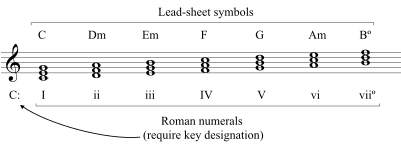

## 다이어토닉 코드

diatonic chord. 어떤 음계에서 그 음계의 구성음으로만 이루어진 코드를 의미한다.

다이어토닉 코드를 분석할 때에 로마숫자로 표기하면 특정 키에 얽매이지 않고 코드 진행을 볼 수 있어서 편리하다.

### 3화음의 경우

| I   | ii  | iii | IV  | V   | vi  | viio   |
| --- | --- | --- | --- | --- | --- | ----------------- |
| C   | Dm  | Em  | F   | G   | Am  | Bm(♭5) |

viio는 감3화음(diminished triad)이며 7화음과의 구분을 위해 VIIm(♭5)로 표기하기도 한다.

### 7화음의 경우

| I△7 | ii7 | iii7 | IV△7 | V7 | vi7 | viio7 |
| -------------- | -------------- | --------------- | --------------- | ------------- | -------------- | ---------------- |
| C△7 | Dm7 | Em7  | F△7  | G7 | Am7 | Go7   |

마찬가지로 viio7는 감7화음인데, 표기에 마이너가 없어도 3음은 단3도이다.

### 코드의 성질

#### 토닉

우리말로 으뜸화음이라고 한다. 안정감을 주어 특히 곡의 끝에 많이 쓰인다.

메이저에서는 I△7이 토닉이며, iii7과 vi7이 대리코드로 쓰일 수 있다.

#### 도미넌트

우리말로 딸림화음이라고 한다. 불안정하며 토닉으로, 혹은 완전5도 아래로 진행하려는 성질이 있다.

메이저에서는 V7이 도미넌트이며, viio7이 대리코드로 쓰일 수 있다

#### 서브 도미넌트

우리말로 버금딸림화음이라고 한다. 도미넌트보다는 덜하지만 토닉으로 진행하려는 성질이 있다.

메이저에서는 IV△7이 서브 도미넌트이며, ii7이 대리코드로 쓰일 수 있다.

## 텐션

코드 위에 더 쌓은 음.

C△7(9, 13)

표기할 때에는 위처럼 9도, 11도, 13도로 표기한다.

- 코드: R부터 시작하여 3도씩 쌓은 3~4화음 (1 - 3 - 5 - 7)
- 텐션: 화음 위로 3도씩 쌓은 추가음 (9 - 11 - 13)

실제로 옥타브 위의 음을 연주할 필요는 없기에, 2, 4, 6음으로 생각해도 좋다.

메이저 다이아토닉 코드별로 사용 가능한 텐션은 아래와 같다.

| 코드          | I7(9, 13) | ii7(9, 11) | iii7(11) | IV7(9, #11, 13) | V7(9, 13) | vi7(9, 11) | vii7(b5, 11, b13) |
| ------------- | -------------------- | --------------------- | ------------------- | -------------------------- | -------------------- | --------------------- | ---------------------------- |
| 텐션          | 9, 13                | 9, 11                 | 11                  | 9, #11, 13                 | 9, 13                | 9, 11                 | 11, b13                      |
| 어보이드 노트 | 11                   | 13                    | b9, b13             |                            | 11                   | b13                   | b9                           |

## 7화음

3화음에 7음을 붙여 만든 화음. R + 3 + 5 + 7로 구성된다.

| 표기           | 3음 | 5음 | 7음 | 이름                                          |
| -------------- | --- | --- | --- | --------------------------------------------- |
| R△7            | 3   | 5   | 7   | 메이저 세븐스                                 |
| R7             | 3   | 5   | b7  | 도미넌트 세븐스                               |
| Rm7            | b3  | 5   | b7  | 마이너 세븐스                                 |
| RmM7           | b3  | 5   | 7   | 마이너-메이저 세븐스                          |
| Ro7 | b3  | b5  | 6   | 디미니시 세븐스                               |
| Rø7            | b3  | b5  | b7  | 하프 디미니시 세븐스. Rm7b5로도 표기하곤한다. |
| R+7            | 3   | #5  | b7  | 어거먼트 세븐스.                              |

## 여러가지 코드 진행

- ii7 - V7 — 투 파이브 코드 진행
  - ii7 - V7 - IV7 — 투 파이브 원
- IV△7 - III7 - vi7 - v7 - I7 — [Just The Two Of Us](https://www.youtube.com/watch?v=Uw5OLnN7UvM) 진행
  - IV△7 III7 vi7 I7
  - Bill Withers - Just The Two Of Us
  - 椎名林檎 - 丸の内ディスチック
  - yama - 春を告げる
  - れをる - 第六感
- IV V iii vi — 왕도진행
- I V vi iii IV I IV V7 — 카논 코드
  - 요한 파헬벨 - [카논 라 장조](https://www.youtube.com/watch?v=JvNQLJ1_HQ0)
- I V vi IV — [Pop-punk chord progression](https://en.wikipedia.org/wiki/I%E2%80%93V%E2%80%93vi%E2%80%93IV_progression)
  - IV I V vi
  - V vi IV I
  - vi IV I V
  - IV I V vi
- vi IV V I — 小室(코무로)진행
  - 작곡가 [코무로 테츠야](https://ja.wikipedia.org/wiki/%E5%B0%8F%E5%AE%A4%E5%93%B2%E5%93%89)가 많이 썼다고 하여 붙은 이름
  - King Gnu - 百日
- IV V I
- I V vi IV
- i bIII bVII IV
- ii V vi iii
- vi IV I V

### 참고

- [【今知るべき】ヒット曲に使われるコード進行 TOP5【ギターで弾こう】 - YouTube](https://youtu.be/am47Et8axbI)
- [J-POP を席巻！定番コード進行 5 選をまとめて紹介～コード特徴、使用楽曲など～ - YouTube](https://www.youtube.com/watch?v=RdQC3A8RqPc)
