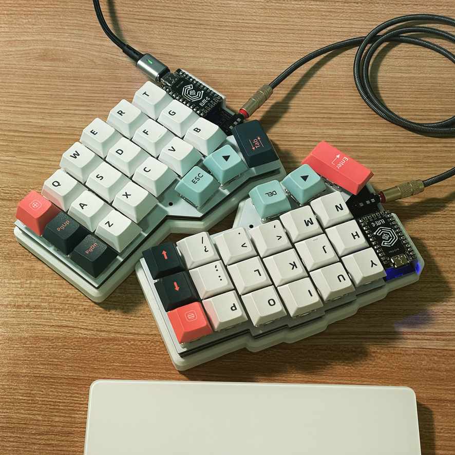

- 📚 전자책 단말기 — [[#오닉스 북스 리프2]]
- 📱 휴대폰 — 아이폰 12 Pro
- ⌨️ 개인용 서버 — [[UiBox]]
- 💻 노트북 — 맥북에어 (M1, 2020)
- ⌨️ 키보드 — [Corne Keyboard](#corne-keyboard)
- 📡 라우터 — [AX2004M](#ax2004m) -- [OpenWRT](openwrt) 깔아서 쓰는 중

## Corne Keyboard

3x6 사이즈 + 3 엄지 세로 스테거 스플릿 키보드

[footsan/crkbd](https://github.com/foostan/crkbd)

- 키캡: 까먹었다
- 스위치: 게이트론 저소음 갈축 → 홀리 판다
- MCU: ELITE-C → nice!nano
- 케이스: 3D printed
- 펌웨어: QMK → ZMK
- 보드: crkbd choco v3 → crkbd cherry v2
- 배열: [[miryoku]] flip inverted T 변형

### 로그

- 2023-03-06 홀리 판다 스위치 풀윤활 완료 (크라이톡스 GPL105)
  - 스템, 스프링 모두 동일한 윤활제로 윤활
	- 윤활 후 기존보다 걸림이 덜 느껴지고 힘이 덜 필요.

## AX2004M

[[openwrt]]를 활용해서 공유기를 보다 다목적으로 써보자

- [x] VPN 서버

### 참고

- 박윤지, [ipTIME AX2004M용 OpenWrt](https://kasugano.tistory.com/m/157).

## 오닉스 북스 리프2

### 장점

- 책 둘 곳 걱정 할 필요가 없다.
- 가볍다 — 185g인데 쓰고 있는 휴대폰(아이폰 12 프로, 187g)보다 넓고 가벼워 훨씬 편하다.
- 눈이 확실히 편하다.
- 크기가 작아 들고다니기 편하다.
- 물리키가 있어 활용이 좋다.

### 단점

- e-ink 패널에 최적화되지 못한 앱이 많다.
	- 특히 색상이 들어간 앱 중에 흑백으로 표시되며 사용이 어려운 앱이 간혹 있다.
- 종이책보다는 몰입이 덜하다.
	- 명암비가 종이책보다 좋지 못하다. 
	- 작은 크기. 왠만한 종이책보다는 화면 크기가 작아 불편하다.
- 프로세서가 느린 게 체감된다.

### 쓰는 앱

- 리디
	- 전자책용 앱이 없어서 일부 애니메이션을 끌 수 없다.
	- 페이지 넘김은 끌 수 있다.
		- 아무 책 열고 → 뷰어 설정 → 페이지 넘김 효과를 효과 없음으로 설정
- Kindle
	- VPN 등 설정 없이도 일본 원서를 볼 수 있다.
	- 물리키가 먹히지 않으며, 페이지 전환 애니메이션을 끌 수 없다. 
- bitwarden — 비밀번호 조회용