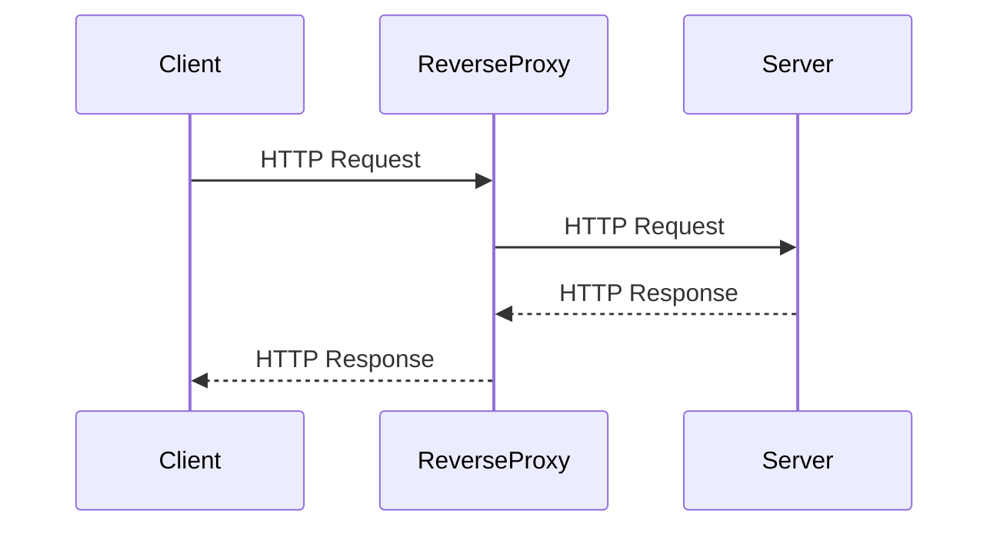

리버스 프록시란 다른 서버의 앞단에 놓이는 프록시 서버로, 클라이언트의 요청을
먼저 받아 여러 처리를 한 후에 필요한 서버에게 보내주는 역할을 한다.



홈 서버에서 운영하는 서비스를 웹으로 노출시키려고 한다.
이때 리버스 프록시를 운영하면 아래와 같은 이점이 있다.

1. 보안. SSL 같은 암호화를 맡아서 처리를 할 수 있다.
   또한 내부 주소를 숨기고 도메인 주소만 노출할 수 있다.
2. 확장. 서브 도메인을 이용하여 여러 서비스를 하나의 도메인으로 노출할 수 있다.
3. 성능. 캐싱, 압축을 적용하여 성능에서 이득을 볼 수 있긴 한데... 얼마나
   이득일지는 잘 모르겠다.

## 외부에서 홈 서버에 접속하기

외부에서 내 홈서버에 접속하여 서비스를 이용하는 시나리오를 그려보자.

먼저 홈 네트워크의 구성은 아래와 같다:

```
                ┌─Proxmox VE──┐
┌───┐  ┌──────┐ │   ┌─────┐   │
│WAN├─►│router├─┼──►│nginx│   │
└───┘  └──────┘ │   └──┬──┘   │
                │      ▼      │
                │  NextCloud  │
                └─────────────┘
```

1. 웹 브라우저에 도메인을 입력한다
2. 이 도메인을 DNS 서버에 질의하여 IP 주소를 확인한다.
3. 확인한 IP 주소로 HTTPS 요청을 보낸다.
4. 라우터는 받은 모든 HTTPS 요청을 Proxmox VE의 nginx에 넘긴다.
5. nginx는 받은 요청을 검사하여 처리 후 적절한 서비스로 넘겨준다.

따라서

- 도메인을 DNS에 등록해야하고
- 라우터에서 nginx로 포트 포워딩 해줘야하고
- nginx에서는 서브도메인을 확인하여 원하는 서비스로 넘겨줘야 한다.

먼저 nginx부터 설정하자.

## Proxmox VE에 nginx 올리기

리버스 프록시 역할을 수행할 수 있는 소프트웨어는 아파치 HTTP 서버, HAProxy 등
다양하다.

그 중 nginx는 설정이 간편하고 기능이 많으며 성능이 좋아 사용하기 편리하다.

Proxmox VE에 무언가를 올릴 때 LXC 혹은 VM으로 올릴 수 있는데, 간편하게 LXC로
설정하였다. 사양은 최소로 잡아놓고, 필요하면 올리는 것으로.

- 템플릿: fedora37-default_20221119_arm
- 메모리: 512MB
- 코어: 1
- 디스크: 8GB
- 네트워크: DHCP

페도라에서 nginx는 `dnf`로 간편하게 설치할 수 있다. 서비스 관리는 `systemd`로
한다.

```
$ dnf install nginx
$ systemctl enable nginx
$ systemctl start nginx
```

nginx 가동 후 `ip addr`로 내부 주소를 확인하고 접속하면 환영 페이지를 볼 수
있다.


## OpenWRT에서 포트포워딩 하기

이제 외부에서 보낸 HTTP/HTTPS 요청을 nginx가 받을 수 있도록 라우터를
설정해주어야 한다. 구체적으로는 라우터가 외부에서 받는 요청을 홈 네트워크의
특정 포인트로 넘겨주도록 포트 포워딩 해주어야 한다.

OpenWrt를 쓰는 경우, 온전한 리눅스이므로 nginx를 라우터에 직접 설치하여 쓸 수도
있다. 추후에 설정을 자주 바꿀 필요가 없어지면 nginx로 옮기는 것도 좋겠다.

- [iptime 공유기에 NGINX를 돌려봅시다.](https://svrforum.com/svr/285089)
- [링크시스 공유기에 NGINX 올려서 Reverse Proxy로 쓰기](https://www.clien.net/service/board/use/17758656)

라우터로 OpenWrt를 쓰고 있는데 OpenWrt는 Network → Port Fowarding에서
포트 포워딩 설정을 할 수 있다.


- 이름: 편한 대로 설정
- 프로토콜: TCP. HTTP3를 고려한다면 UDP도 해야한다.
- 소스: 외부에서 입력을 받을 것이기에 `wan` 선택
- 외부 포트: HTTP 포트인 80, HTTPS 포트인 443을 열어준다.
- 목적지: 내부 네트워크를 고르면 된다.
- 내부IP: nginx를 설치한 서버의 IP
- 내부 포트: 굳이 바꿀 필요 없이 80, 443을 쓰자

포트를 한 번에 하나만 입력할 수 있으므로 두 개를 만들어야 한다.

이렇게 바꾼 후 외부 IP를 확인하여 접속하면 내부에서 접속했을 때와 동일한
화면을 볼 수 있다.

## cloudflare에 DNS 등록

이제 도메인 주소와 IP를 연결하면 일반적인 웹 주소로 내 홈 서비스에 접속할 수 있다.
DNS 등록은 DNS 제공 서비스를 통해 해야하는데, 본래 쓰던 [cloudflare](https://www.cloudflare.com/)를
이용하였다.

- 타입: A
- 이름: www, @, \*
- 주소: 내 IP주소
- proxy: DNS only
- TTL: auto


www와 루트(@), 와일드카드(\*) 세 개를 등록하자. 완료하면 이제 [nyeong.me](http://nyeong.me)로
접속하면 IP주소로 접속했을 때와 동일한 화면을 볼 수 있다.

### 레코드 종류

- A 레코드
- CNAME 레코드

## Let's Encrypt로 인증서 받기

지금은 http 프로토콜을 이용한 접속만 가능하다. https를 쓰려면 인증기관(CA)에서
SSL 인증서를 발급받아야한다. 여러 CA가 있는데 그중
[Let's Encrypt](https://letsencrypt.org/)는 무료로 인증서를 발급해준다.

Let's Encrypt에 사이트를 인증하려면 ACME 프로토콜을 이용해야한다. 이를 지원하는
[여러 클라이언트](https://letsencrypt.org/docs/client-options/)가 있는데

[Cloudflare API 토큰](https://dash.cloudflare.com/profile/api-tokens)을
발급받는다.

- 권한: DNS에 대한 편집 권한
- 리소스: DNS에 등록한 도메인 주소

완료하면 API 토큰을 발급해준다. 이 토큰을 이용하여 SSL 인증서를 발급받을 것이다.

```
$ dnf install git openssl
$ git clone https://github.com/acmesh-official/acme.sh.git
$ cd ./acme.sh
$ mkdir /etc/nginx/ssl/
$ ./acme.sh --install --force -m me@annyeong.me
$ export CF_Token="위에서 발급받은 토큰"
$ export CF_Email="cloudflare 이메일"
$ acme.sh --issue \
          --dns dns_cf \
          --server letsencrypt \
          -d nyeong.me -d '*.nyeong.me' \
          --keylength ec-256 \
          --key-file /etc/nginx/ssl/privkey.pem \
          --fullchain-file /etc/nginx/ssl/fullchain.pem \
          --cert-file /etc/nginx/ssl/chain.pem \
          --reloadcmd "systemctl reload nginx.service"
```

- acme.sh는 install 할 때 cron이 존재하는지 검사한다. 페도라는 `systemd`를
  이용하므로 cron이 없으므로 `--force` 명령어로 진행시킨다.
  `acme.sh --cron`

이후 `acme.sh list` 확인하면 잘 발급되었음을 볼 수 있다.

```
$ acme.sh list
Main_Domain  KeyLength  SAN_Domains  CA               Created               Renew
nyeong.me    "ec-256"   *.nyeong.me  LetsEncrypt.org  2023-03-20T05:03:49Z  2023-05-18T05:03:49Z
```

SSL 설정은 모질라의
[SSL Configuration Generator](https://ssl-config.mozilla.org/#server=nginx&version=1.22.1&config=modern&openssl=3.0.5&guideline=5.6)를
이용하였다.

```
server {
		listen       443 ssl http2;
		listen       [::]:443 ssl http2;
		server_name  _;
		root         /usr/share/nginx/html;

		ssl_certificate "/etc/nginx/ssl/fullchain.pem";
		ssl_certificate_key "/etc/nginx/ssl/privkey.pem";
		ssl_trusted_certificate /etc/nginx/ssl/chain.pem;
		ssl_session_cache shared:MozSSL:10m;
		ssl_session_timeout  1d;
		ssl_session_tickets off;

		ssl_protocols TLSv1.3;
		ssl_prefer_server_ciphers off;

		add_header Strict-Transport-Security "max-age=63072000" always;

		# OCSP stapling
		ssl_stapling on;
		ssl_stapling_verify on;

		# verify chain of trust of OCSP response using Root CA and Intermediate certs

		# replace with the IP address of your resolver
		resolver 127.0.0.1;
}
```

### 리버스 프록시

ㅈ

### nextcloud

occ 실행

```
su www-data -s /usr/bin/php /var/www/nextcloud/occ
```
