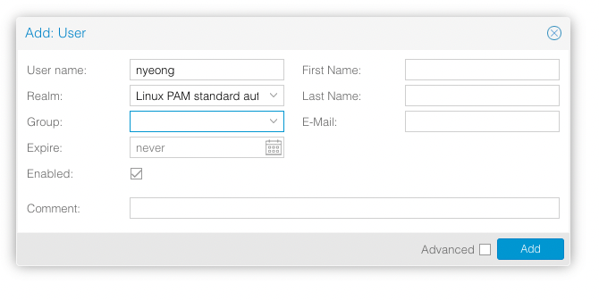

## 유저 설정하기

항상 시스템 구성하면 root 외의 유저 계정 생성하고 SSH 접속 제한하자.

서버에 접속하여 `adduser`로 유저를 생성한다.

```
$ adduser nyeong
$ apt install sudo
$ groupadd sudoers
$ usermod -g suoders nyeong
$ EDITOR=vi visudo
$ su nyeong
```

로컬로 빠져나와 SSH 공개키를 서버로 복사한다.

```
$ ssh-copy-id 192.168.1.100
/usr/bin/ssh-copy-id: INFO: Source of key(s) to be installed: "/Users/nyeong/.ssh/id_ed25519.pub"
/usr/bin/ssh-copy-id: INFO: attempting to log in with the new key(s), to filter out any that are already installed
/usr/bin/ssh-copy-id: INFO: 1 key(s) remain to be installed -- if you are prompted now it is to install the new keys
nyeong@192.168.1.100's password:

Number of key(s) added:        1

Now try logging into the machine, with:   "ssh '192.168.1.100'"
and check to make sure that only the key(s) you wanted were added.
```

다시 서버에 접속하여 ssh 설정을 바꾼다.

```
# /etc/ssh/sshd_config
PasswordAuthentication no
PermitRootLogin no
```

그 후 다시 `ssh` 서비스를 재시작한다.

```
$ sudo systemctl restart ssh
```

이후 ssh로 root로 로그인은 불가능하다.

리눅스 계정이 있더라도 Proxmox VE 유저는 별도로 추가해야한다.
`https://proxmox-ip:8006`으로 이동하여 proxmox 웹 환경에 접속하여
datacenter -> permissions -> user로 이동하여 유저를
추가한다. `Realm`은 `Linux PAM`으로, 유저이름은 방금 추가한 리눅스 유저이름으로
한다.



## 패키지 저장소 관리

기업 지원 패키지는 유료이기 때문에 주석처리한다.

```
vi /etc/apt/sources.list.d/pve-enterprise.list
```

`/etc/apt/sources.list` 파일에 비 구독 저장소를 추가한다.

```
deb http://download.proxmox.com/debian/pve bullseye pve-no-subscription
```

```
apt update
apt dist-upgrade
```

## 컨테이너 만들기

다음의 명령어로 컨테이너 이미지 목록을 업데이트한다.

```
$ sudo pveam update
$ sudo pveam available
```

## 유용한 명령어

```
pct enter <vmid>
```

