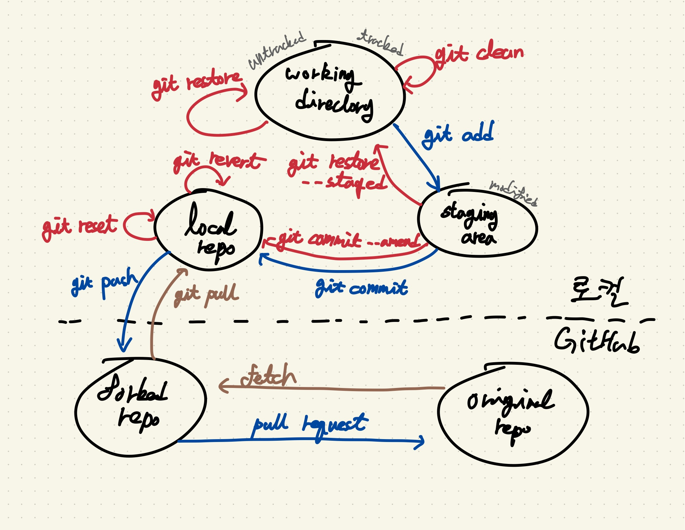

# git



## 추적하지 않는 파일 삭제

untracked file을 한 번에 삭제하기

```
$ git clean -f
$ git clean -fd # 디렉토리도 지우기
```

## 스테이징 하지 않은 작업 취소

```
$ git restore .
```

## 수정사항 확인하기

```
$ git diff
```

## 참고

- [Oh Shit, Git!?!](https://ohshitgit.com/ko)
- [새 버전에 맞게 git checkout 대신 switch/restore 사용하기](https://blog.outsider.ne.kr/1505)
