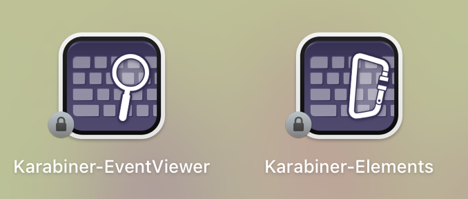
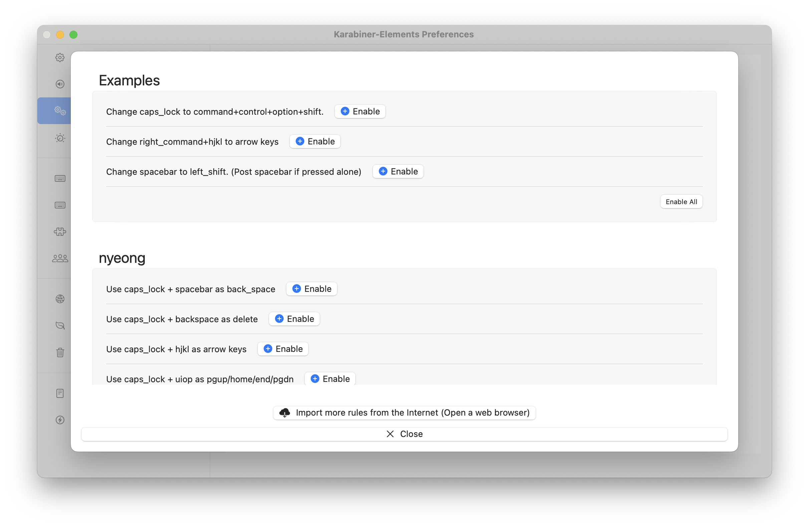
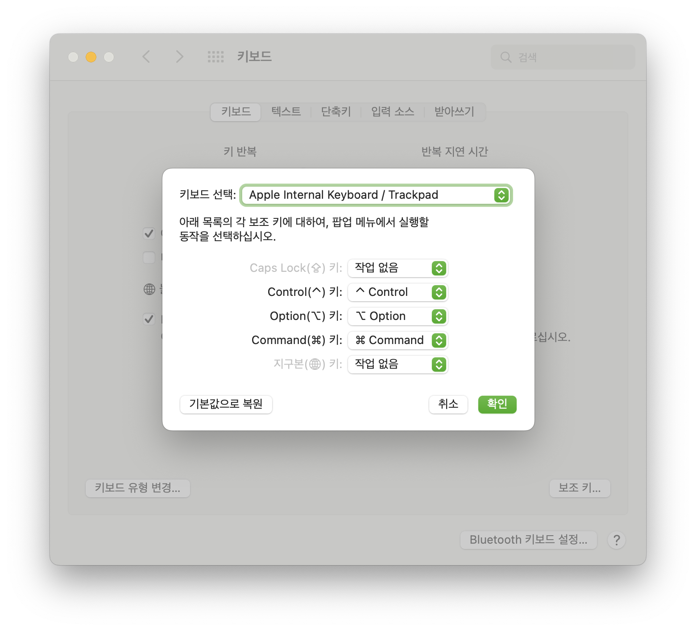

# macOS에서 Vim 방향키 사용하기

vim 계열 텍스트 편집기는 H, J, K, L을 이용하여 커서를 좌, 하, 상, 우로 움직일 수 있습니다.
오른손을 원래 자리에서 때고 방향키로 옮기지 않고도 편하게 커서를 옮길 수 있어서 매우 유용합니다.

macOS에서 [Karabiner](https://karabiner-elements.pqrs.org/)를 이용하면 같은 동작을 구현할 수 있습니다.

자동화 도구인 [Hammerspoon](https://www.hammerspoon.org/)을 이용해서도 구현할 수 있으나, 체감상 karabiner가
더 빠릿한 느낌입니다.

## 짧은 설명

먼저 Karabiner-Elements를 다운로드 받습니다. [공식 홈페이지](https://karabiner-elements.pqrs.org/)에서 
받아도 좋고, 아래 명령어로 `brew`를 이용해 받을 수도 있습니다.

```bash
brew install karabiner-elements
```



받고 나면 Karabiner-Elements와 Karabiner-EventViewer를 쓸 수 있습니다. EventViewer는 디버깅 등에 유용한 이벤트 뷰어로 현재는 불필요합니다.

[설정 파일](https://github.com/nyeong/.dotfiles/blob/2f7e43f314941bbd3c323ad9a21805cd3fe00f35/karabiner/assets/complex_modifications/nyeong.json)을 내려받습니다.
`curl` 명령어로 내려받을 수 있습니다.
내려받은 후 `~/.config/karabiner/assets/complex_modifications` 디렉토리 밑으로 파일을 넣어줍니다.

```bash
cd ~/Downloads
curl https://raw.githubusercontent.com/nyeong/.dotfiles/2f7e43f314941bbd3c323ad9a21805cd3fe00f35/karabiner/assets/complex_modifications/nyeong.json --output nyeong.json
mkdir -p ~/.config/karabiner/assets/complex_modifications
mv nyeong.json ~/.config/karabiner/assets/complex_modifications/
```

그 후 Karabiner-Elements를 켜면 Complex Modifications 탭에서 설정 파일의 규칙을 적용할 수 있습니다.



위의 설정은 아래의 동작을 합니다.

- 캡슬락을 짧게 누르면 ESC키로 동작합니다
- 캡슬락을 누른 채로 H, J, K, L을 누르면 방향키로 동작합니다.
- 캡슬락을 누른 채로 U, I, O, P를 누르면 Page Up, Home 등으로 동작합니다.
- 캡슬락을 누른 채로 스페이스 바를 누르면 백스페이스로 동작합니다.
- 캡슬락을 누른 채로 백스페이스를 누르면 delete로 동작합니다.

캡슬락을 이용하는 설정이므로 
`시스템 환경설정` → `키보드` → `보조키...`에 들어가 Caps Lock키를 작업 없음으로 설정해줍니다.

