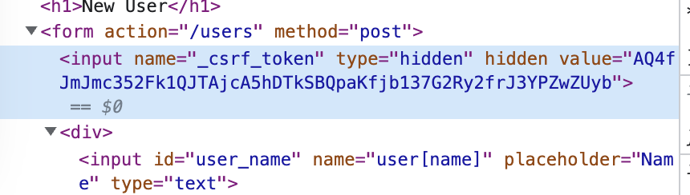

- 웹
	- 인터넷
	- HTTP
	- DNS, 도메인
- 프로그래밍 언어와 웹 프레임워크
	- Elixir with [[phoenix]]
	- JavaScript with NextJS
- 버전 컨트롤과 협업
	- Git
	- GitHub
- [[데이터베이스]]
	- RDBMS (PostgreSQL)
	- NoSQL 데이터베이스
	- N+1 문제, 트랜잭션, 정규화, ACID, ORM, 인덱싱, ...
- API
	- 상태 관리 (쿠키, 세션, JWT)
	- 인/허가
	- REST, JSON, gRPC, GraphQL, ...
- 테스트
	- 단위 테스트
	- 통합 테스트
	- 종단간 테스트
	- CI
- 보안
	- 단방향 암호화 (해싱)
	- 양방향 암호화 (대칭, 비대칭)
	- SSL/TLS
- 배포
	- 웹서버 (nginx)
	- CI/D
	- 가상화와 컨테이너
- 기초 CS
	- 운영체제
	- 동시성 문제
	- 프로세스 관리

## 보안

### OWASP

[OWASP Top Ten | OWASP Foundation](https://owasp.org/www-project-top-ten/)

**OWASP**(Open Web Application Security Project)는 웹 애플리케이션에 대한 보안을 연구하는 프로젝트이다. 그중 영향력이 큰 10개를 3~4년에 한 번 씩 TOP10으로 발표한다. 번호는 `A번호:년도`로 붙인다.

[OWASP Cheat Sheet Series](https://cheatsheetseries.owasp.org/index.html)

OWASP Cheat Sheet에서 각 공격 방법에 대한 소개와 방어법을 간결하게 볼 수 있다.

### CSRF

[Cross Site Request Forgery (CSRF) | OWASP Foundation](https://owasp.org/www-community/attacks/csrf)

Cross Site Request Forgery attack. 크로스-사이트 요청 변조는 인증된 웹 애플리케이션을 통하여 사용자가 원치 않는 작업을 실행하는 공격이다.

#### CSRF 토큰

- 서버는 클라이언트에게 무작위하고 유일한 CSRF 토큰을 발행한다.
- 클라이언트는 요청을 보낼 때 CSRF 토큰을 포함하여 요청을 보낸다.
- 서버는 클라이언트가 보낸 CSRF 토큰이 유효한지 확인하여 요청이 안전한지 검증한다.

공격자는 유효한 CSRF 토큰을 만들어낼 수 없기 때문에, 공격자가 의도한 요청이 아님을 알 수 있다.

대부분의 웹 프레임워크는 아래와 같이 `form`을 생성할 때 CSRF 토큰 필드를 함께 생성한다:

<figure>
  
  <figcaption>Phoenix 프레임워크가 생성한 csrf_token</figcaption>
</figure>

## 참고

- [Backend Developer Roadmap](https://roadmap.sh/backend)
- [코드 리뷰는 스포츠다 - 재그지그의 개발 블로그](https://wormwlrm.github.io/2023/02/20/Code-Review-is-a-Sports.html)